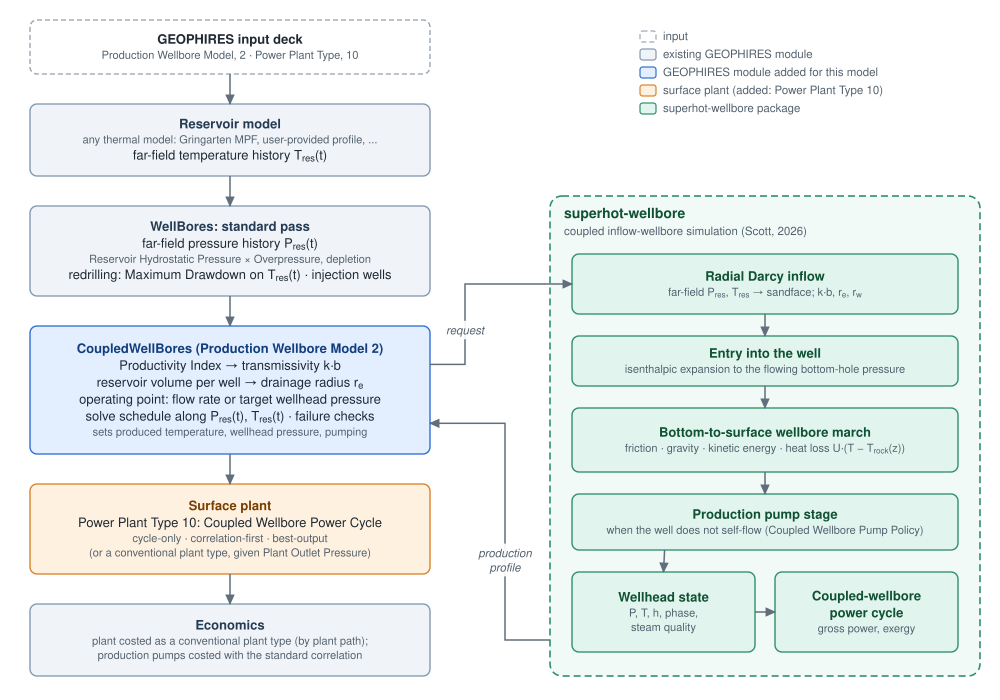
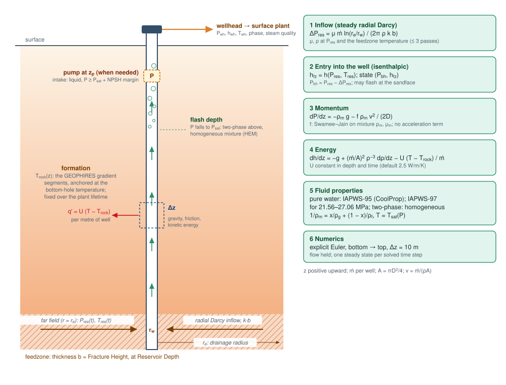
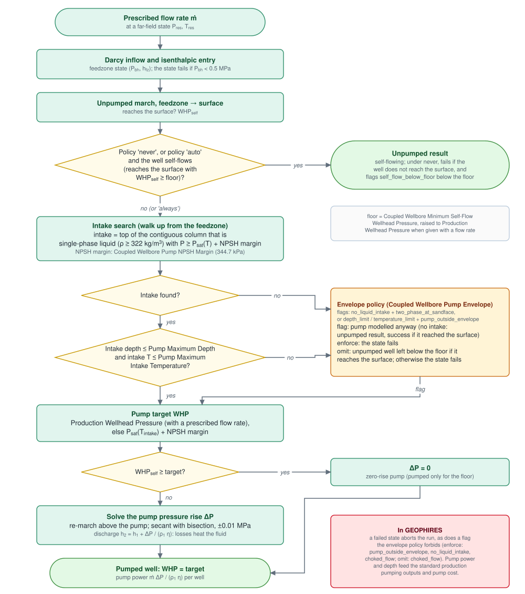
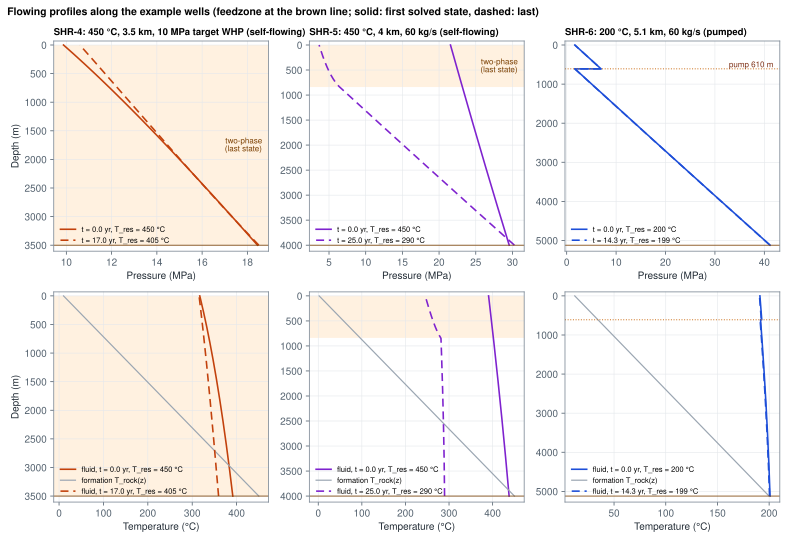
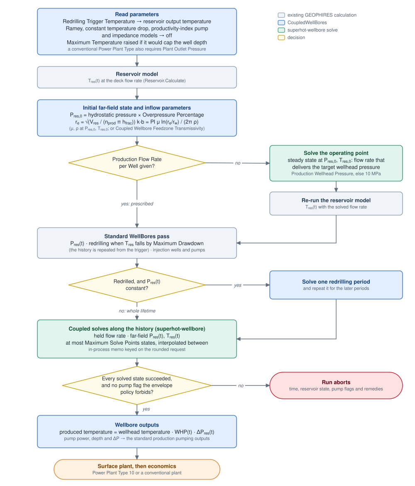
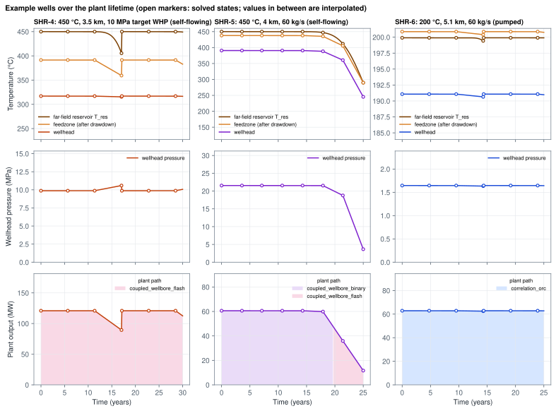
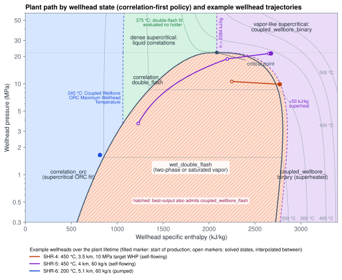

# Coupled Inflow-Wellbore Model

_Production Wellbore Model 2 (Coupled Inflow-Wellbore) and Power Plant Type 10 (Coupled Wellbore Power Cycle)_

> **Status: draft for subject-matter-expert review.** This page documents the model as implemented, including its
> idealizations and the issues found while documenting it. Section 8 lists the questions we would most like reviewers to
> answer. The first two parts of the [Reviewer guide](#reviewer-guide) say how to respond.

GEOPHIRES normally treats a production well in three separate steps:

- a productivity index turns the flow rate into a reservoir drawdown;
- Ramey's model, or a fixed temperature drop, gives the heat lost up the well;
- the surface plant correlations turn the produced _temperature_ of liquid water into electricity.

These steps are adequate for pumped, liquid-dominated wells. They do not describe a well that flashes, flows on its
own, or delivers superheated or supercritical fluid to the surface. That is the regime of superhot rock (SHR)
reservoirs above the critical temperature of water (374 °C), and also of many conventional wells hotter than about
250 °C.

The coupled inflow-wellbore model replaces the three steps with one steady-state simulation of the well, from the
far-field reservoir to the wellhead. The simulation is done by the
[superhot-wellbore](https://github.com/softwareengineerprogrammer/superhot-wellbore) package (Scott, 2026). It
couples:

- radial Darcy inflow;
- isenthalpic entry into the well;
- a bottom-to-surface thermohydraulic march with flashing and heat loss;
- a downhole pump when the well cannot flow on its own.

It returns the wellhead pressure, temperature, specific enthalpy and phase.

A companion surface plant, Power Plant Type 10, turns that wellhead state into electricity, either with a power cycle
analysis of the actual wellhead enthalpy and pressure or with GEOPHIRES's own correlations chosen by wellhead phase.

The model pairs with any GEOPHIRES thermal reservoir model. The reservoir model provides the far-field temperature
history; the coupled model provides everything between the far field and the wellhead.

## Reviewer guide

**How to respond.** Comment on the pull request or send notes, citing the question IDs in section 8 (R1–R14) and the
known-issue IDs in section 7 (K1–K19). Each question states what the model assumes now and what we would change
depending on the answer.

**Where to focus by expertise:**

| Expertise                       | Sections      | Questions   |
|---------------------------------|---------------|-------------|
| Reservoir engineering, well testing | 2.1, 3.2, 3.4 | R1, R2, R3 |
| Wellbore two-phase flow         | 2.2           | R4, R5, R6  |
| Artificial lift                 | 2.3           | R7          |
| Geothermal power plants         | 2.4, 4        | R8–R11      |
| Techno-economic modeling        | 3.4, 3.5, 4   | R12–R14     |

**What has been checked.** Every equation, default value and decision rule on this page was taken from the source
code of GEOPHIRES (`CoupledWellBores.py`, `SurfacePlantCoupledWellbore.py`) and superhot-wellbore (`reservoir.py`,
`wellbore_physics.py`, `power_cycle.py` and `client/`). Where the code differs from its own documentation or from the
literature it cites, the difference is listed in section 7. The findings marked _verified_ there were reproduced
numerically.

**Try it.** Three examples cover the main regimes:

- `tests/examples/example_SHR-4.txt`: a self-flowing superhot well that delivers slightly superheated steam;
- `tests/examples/example_SHR-5.txt`: a self-flowing well whose wellhead starts near the critical pressure and
  declines into two-phase;
- `tests/examples/example_SHR-6.txt`: a 200 °C well that must be pumped.

Section 5 summarizes them.

## 1 Overview



_Figure 1. Where the coupled model sits in a GEOPHIRES run. `CoupledWellBores` translates GEOPHIRES parameters into
a superhot-wellbore request, solves the production history, and writes the results back into the standard wellbore
outputs that the surface plant and economics read._

### Enabling the model

```
Production Wellbore Model, 2                -- Coupled Inflow-Wellbore
Power Plant Type, 10                        -- Coupled Wellbore Power Cycle (optional; see section 4)
Production Wellhead Pressure, 10 MPa        -- or: Production Flow Rate per Well, 60
```

The model requires the superhot-wellbore package, which the GEOPHIRES installation normally installs. To install it
separately:

```
pip install git+https://github.com/softwareengineerprogrammer/superhot-wellbore.git@geophires-client
```

### What changes compared with the standard wellbore model

| Quantity | Standard GEOPHIRES | Coupled inflow-wellbore model |
|---|---|---|
| Reservoir drawdown | `ΔP = ṁ / PI` (Productivity Index) | radial Darcy flow with transmissivity `k·b`, fluid properties evaluated at the flowing state (2.1) |
| Flow rate per well | input | input, or solved for a target wellhead pressure at the start of production (3.4) |
| Wellbore heat loss | Ramey's transient model, or a fixed temperature drop | steady conduction with a constant coefficient `U` to a static geotherm (2.2) |
| Wellbore pressure and phase | not modeled; liquid assumed | pressure–enthalpy march with flashing, superheated and supercritical states (2.2) |
| Production pumping | productivity-index pump model: the pump is set deep enough to keep the produced fluid liquid | pump only where the well cannot self-flow; its depth comes from the liquid column in the well (2.3) |
| Wellhead state | temperature | pressure, temperature, specific enthalpy, phase, steam quality |
| Power plant | correlations in temperature for liquid water | Power Plant Type 10: a cycle analysis in (P, h), or correlations chosen by wellhead phase (4) |
| Injection wells, reservoir model, economics | unchanged | unchanged |

## 2 Physical model

The equations in this section are those of superhot-wellbore (Scott, 2026). They are solved for one production well
at one far-field reservoir state, i.e. as a steady state. Section 3 describes how GEOPHIRES strings these steady
states along the plant lifetime.



_Figure 2. Geometry and governing equations. All quantities are per production well. `ṁ` is the mass flow rate and
`z` is positive upward._

### 2.1 Reservoir inflow

**Drawdown.** Steady-state radial Darcy flow from a constant-pressure boundary at the drainage radius `r_e` to the
wellbore radius `r_w`:

```
ΔP_res = μ · ṁ · ln(r_e / r_w) / (2π · ρ · k·b)          P_bh = P_res − ΔP_res
```

- `k·b` is the feedzone transmissivity (permeability–thickness product).
- `r_w` is half the casing inner diameter (Production Well Diameter).
- `r_e` is derived from the reservoir volume (3.2).

**Fluid properties.** Viscosity `μ` and density `ρ` come from CoolProp at the far-field pressure `P_res` and a
temperature that is iterated:

1. Start from the reservoir temperature.
2. After each pass, set the temperature to the feedzone temperature.
3. Stop when successive temperatures differ by less than 1 °C, or after at most three passes.

The properties are therefore evaluated at a mixed state, (far-field pressure, feedzone temperature). The package
documents that this underpredicts the drawdown by about 10–15 % at 4 MPa drawdown and 30–40 % at 8 MPa under IDDP-1
conditions. It keeps this choice because the resulting calibrated transmissivities agree better with independent
estimates (Scott, 2026). See R1 and K4.

**Entry into the well** is isenthalpic. The specific enthalpy of the far-field state, `h = h(P_res, T_res)`, is
carried to the flowing bottom-hole pressure, so the feedzone state is (`P_bh`, `h`). Expansion cools steam-like and
supercritical fluid strongly, and can flash it at the sandface. Compressed liquid warms slightly (the Joule–Thomson
effect): in example SHR-6 the feedzone is 200.9 °C for a 199.9 °C reservoir. The state fails if `P_bh` < 0.5 MPa.

**Idealizations:**

- steady state, with no transient or pseudo-steady-state term;
- no skin factor and no non-Darcy (turbulent) term;
- single-phase flow in the reservoir;
- no hydrostatic correction between the reservoir pressure datum and the feedzone.

The package calls the result "an idealized upper bound" on deliverability.

### 2.2 Wellbore flow

A one-dimensional, vertical, constant-diameter pipe, marched from the feedzone to the surface.

**Mass.** `ṁ` is constant along the well, and `v = ṁ / (ρ A)` with `A = π D² / 4`.

**Momentum:**

```
dP/dz = −ρ_m g − f ρ_m v² / (2D)
```

- The acceleration term `ρ v dv/dz` is omitted, following Nathenson (1974). The package cites Tonkin et al. (2021,
  section 7.1): omitting it overestimated the wellhead pressure by about 35–40 % in an aggressively flashing test
  case. The package argues the term is small for the single-phase or high-quality flow of superhot wells. See K5 and
  R4.
- `f` is the Darcy friction factor from the Swamee–Jain explicit approximation of Colebrook. It is evaluated with the
  mixture density and viscosity, with casing roughness 0.046 mm by default. There is no two-phase multiplier.

**Energy:**

```
dh/dz = −g + (ṁ/A)² ρ⁻³ dρ/dz − U (T − T_rock(z)) / ṁ
```

- The kinetic-energy term is kept here, although the acceleration term is omitted from momentum.
- Friction does not appear because the equation is written in total enthalpy.
- `U` is a heat loss coefficient per metre of well (W/m/K), constant in depth and in time. The default is 2.5 W/m/K,
  from Albertsson et al. (2003) for a 9⅝ in well in basalt after one year of production.
- There is no time-dependent conduction term like Ramey's: heat loss does not diminish as the formation around the
  well warms up. See K6 and R5.

**Formation temperature.** `T_rock(z)` is piecewise linear through the GEOPHIRES geothermal gradient segments, from
Surface Temperature to the bottom-hole temperature at the feedzone. It is fixed over the plant lifetime, even when the
reservoir cools.

**Two-phase flow.** The homogeneous equilibrium model: no slip, and `T = T_sat(P)` inside the saturation dome:

```
1/ρ_m = x/ρ_g + (1 − x)/ρ_f          μ_m = ρ_m [x μ_g/ρ_g + (1 − x) μ_f/ρ_f]
```

**Fluid properties.**

- Pure water, from the pressure and specific enthalpy.
- CoolProp (IAPWS-95) everywhere except between 21.564 and 27.064 MPa, where IAPWS-97 (the `iapws` package) is used.
- Within 0.5 MPa of the critical pressure, density, viscosity and temperature are relaxed toward the previous step
  (weighting 0.9 new, 0.1 previous) for numerical stability.
- Phases:
  - `two_phase` inside the dome;
  - otherwise `single_phase_vapor` if ρ < 322 kg/m³ (the critical density);
  - otherwise `single_phase_liquid`, a label that includes dense supercritical fluid.
- The client labels any wellhead at or above 22.064 MPa `supercritical`.

**Numerics.** Explicit Euler in depth, with step Δz (Coupled Wellbore Integration Step, 10 m by default). The well
depth is rounded to a whole number of steps. The march ends early if the pressure reaches zero. A well "reaches the
surface" if the march ends within 2Δz of it.

**Choked flow.** Checked as velocity > sound speed. Sound speed is undefined in the two-phase region, so choking is
never detected there. See K2 and R6.

### 2.3 Production pump stage

For a prescribed flow rate, the pump stage decides whether, where and how hard to pump. It never runs when the flow
rate itself is being solved for a target wellhead pressure.



_Figure 3. Decision flow of the pump stage (superhot-wellbore `client/pump.py`). The flags listed in the orange box
are reported in the GEOPHIRES output Production Pump Flags._

The main decision rules:

- **Self-flow.** The unpumped well self-flows if it reaches the surface with a wellhead pressure of at least the floor.
  The floor is Coupled Wellbore Minimum Self-Flow Wellhead Pressure (1 MPa by default), raised to Production Wellhead
  Pressure when both that and a flow rate are given.
- **Pump policy** (Coupled Wellbore Pump Policy):
  - `auto`, the default, pumps only a well that does not self-flow;
  - `always` pumps whenever there is an intake;
  - `never` returns the unpumped well, which fails if it does not reach the surface.
- **Intake.** The top of the contiguous column, measured from the feedzone upward, that is single-phase liquid
  (ρ ≥ 322 kg/m³) with `P ≥ P_sat(T) + NPSH margin`. The NPSH margin is 344.7 kPa, the same 50 psi as GEOPHIRES's
  productivity-index pump model.
- **Envelope.** Coupled Wellbore Pump Maximum Depth (1500 m) and Maximum Intake Temperature (250 °C) represent an
  electric submersible pump. Coupled Wellbore Pump Envelope decides what happens outside them:
  - `flag` models the pump anyway and reports the condition;
  - `enforce` fails the state;
  - `omit` leaves a well that reaches the surface unpumped, below the floor.
- **Target and pressure rise.** The pumped wellhead pressure is Production Wellhead Pressure, if given with a flow
  rate, or else `P_sat(T_intake) + NPSH margin`. The pressure rise ΔP is found by re-marching the section above the
  pump (secant iteration with bisection safeguard, ±0.01 MPa).
  - Pump losses heat the fluid: `h₂ = h₁ + ΔP/(ρ₁ η)`.
  - Pump power per well is `ṁ ΔP / (ρ₁ η)`, where η is Circulation Pump Efficiency.
  - If the unpumped well already meets the target (it was pumped only because it was below the floor), ΔP = 0.

| Flag | Meaning |
|---|---|
| `self_flow_below_floor` | reaches the surface, but below the floor |
| `no_liquid_intake`, `two_phase_at_sandface` | no qualifying intake point, not even at the feedzone |
| `depth_limit` / `temperature_limit` | the intake is deeper / hotter than the envelope |
| `pump_outside_envelope` | either envelope limit exceeded |
| `choked_flow` | the march found velocity above the sound speed (set by the client) |

### 2.4 Coupled-wellbore power cycle

For every solved state, superhot-wellbore also analyzes a power cycle on the wellhead stream. Power Plant Type 10 uses
this analysis (section 4); with a conventional plant it is only reported.

**Cycle selection.** A binary cycle is used if `h_wh ≥ h_sel(P_wh) + 50 kJ/kg`, otherwise a flash cycle.

- `h_sel` is the saturated-vapor enthalpy below the critical pressure, and 2084 kJ/kg (the critical enthalpy) at or
  above it.
- Slightly superheated vapor, within 50 kJ/kg of saturation, therefore goes to the flash cycle and its superheat is
  discarded.

**Flash cycle.**

1. The wellhead stream flashes isenthalpically to 1 MPa.
2. The separated steam expands through the turbine to the 0.01 MPa condenser.
3. The separated brine produces no work.

The cycle fails, giving no power, if the wellhead pressure is below 1 MPa.

**Binary cycle.** The working fluid is water at 1 MPa, not an organic fluid (following Dichter, 2025).

- It is heated from 40 °C to 5 K below the geofluid temperature (the hot-end pinch).
- The geofluid is cooled to the rejection temperature. GEOPHIRES sets this to Injection Temperature, but at least
  41 °C.
- There is no internal pinch check and no feed pump work.

**Turbine.** Two stages:

1. A dry stage, with isentropic efficiency 0.85, from the inlet to the saturated-vapor line.
2. A wet stage, from the saturated-vapor line to the condenser, with the Baumann wetness correction as formulated by
   DiPippo (2012, Eq. 5.15).

Exit quality below 0.85 is not prevented. See K1: the implemented wet-stage equation is not Eq. 5.15.

**Output.** Gross turbine shaft power, with no parasitic loads and no generator losses. Utilization efficiency is
defined as `η_u = W / (ṁ e)`:

- `W` is the gross turbine power;
- `e = (h − h₀) − T₀ (s − s₀)` is the specific exergy of the wellhead stream;
- the dead state is saturated liquid at `T₀`, which GEOPHIRES sets to Ambient Temperature.



_Figure 4. Pressure and temperature along the three example wells at their first (solid) and most-declined (dashed)
solved states. The shaded bands are two-phase. Details:_

- _SHR-4 enters the well as superheated steam and stays vapor to the wellhead. By the end of its redrilling period
  (17 years, 405 °C far field) the fluid flashes at the sandface, so the whole column is two-phase._
- _SHR-5 enters the well supercritical. By year 25 (290 °C far field) it flashes in the upper 840 m._
- _SHR-6 cannot lift 60 kg/s from 5.1 km on its own and is pumped from 610 m. The pump appears as the pressure step._

_The formation temperature (grey) is the static geotherm used for heat loss._

## 3 Coupling to GEOPHIRES

### 3.1 Calculation sequence



_Figure 5. Calculation sequence in `CoupledWellBores.read_parameters` and `CoupledWellBores.Calculate`._

### 3.2 Parameter mapping

The model reuses standard GEOPHIRES parameters wherever their meaning is the same:

| GEOPHIRES parameter | Used as | Notes |
|---|---|---|
| Reservoir model temperature history (`Tresoutput`) | far-field temperature `T_res(t)` | any thermal reservoir model; redrilled by the standard wellbore pass (3.5) |
| Reservoir Hydrostatic Pressure (or the built-in correlation) × Overpressure Percentage | far-field pressure `P_res,0` | history `P_res(t)` from the standard Overpressure Depletion Rate mechanism |
| Productivity Index | transmissivity `k·b = PI · μ · ln(r_e/r_w) / (2π ρ)`, with μ, ρ at (P_res,0, T_res,0) | unless Coupled Wellbore Feedzone Transmissivity is given; see R2 |
| Fracture Height | feedzone thickness `b` | used for `r_e` only |
| Calculated reservoir volume ÷ Number of Production Wells | `r_e = √(V_well / (π b))` | must exceed 2 `r_w`; see R3 |
| Reservoir Depth | well depth (feedzone) | rounded to whole integration steps |
| Production Well Diameter | casing inner diameter `D`; `r_w = D/2` | |
| Surface Temperature, Gradient segments | formation temperature `T_rock(z)` | anchored to the bottom-hole temperature |
| Production Flow Rate per Well / Production Wellhead Pressure | operating point (3.4) | 10 MPa target if neither is given |
| Circulation Pump Efficiency | pump efficiency η | |
| Ambient Temperature | exergy dead state `T₀` of the power cycle | |
| Injection Temperature | binary-cycle rejection temperature; heat-extraction reference | at least 41 °C for the cycle |
| Plant Lifetime, Time steps per year | time vector of the production history | |
| Maximum Drawdown | redrilling trigger, on the reservoir output temperature | Redrilling Trigger Temperature is forced to 1 (3.5) |
| Maximum Temperature | raised automatically, with a warning, if it would cap the well above the feedzone | superhot reservoirs exceed the 400 °C default |

These parameters are switched off, with a warning where the user set them:

- Ramey Production Wellbore Model and Production Wellbore Temperature Drop;
- the productivity-index production pump model;
- the reservoir impedance model.

A conventional Power Plant Type used with the coupled model also requires Plant Outlet Pressure, because the
injection pumps are sized from it.

### 3.3 Coupled Wellbore parameters

| Parameter | Default | Meaning |
|---|---|---|
| Coupled Wellbore Feedzone Transmissivity | −1 (derive from PI) | `k·b` in md·m, as in Scott (2026) |
| Coupled Wellbore Casing Roughness | 4.6×10⁻⁵ m | absolute roughness for Swamee–Jain |
| Coupled Wellbore Heat Loss Coefficient | 2.5 W/m/K | `U` per metre of well |
| Coupled Wellbore Integration Step | 10 m | march step Δz (whole metres) |
| Coupled Wellbore Maximum Solve Points | 8 | coupled solves per history (or per redrilling period); 0 = every time step |
| Coupled Wellbore Pump Policy | auto | never / auto / always (2.3) |
| Coupled Wellbore Pump Envelope | flag | flag / enforce / omit (2.3) |
| Coupled Wellbore Pump Maximum Depth | 1500 m | pump setting depth limit |
| Coupled Wellbore Pump Maximum Intake Temperature | 250 °C | pump intake temperature limit |
| Coupled Wellbore Minimum Self-Flow Wellhead Pressure | 1000 kPa | self-flow floor under `auto` |
| Coupled Wellbore Pump NPSH Margin | 344.7 kPa | intake margin above vapor pressure; also the pumped wellhead margin |
| Coupled Wellbore Power Cycle Parasitic Load | 0.10 | derate of the gross coupled-wellbore cycle (4) |
| Coupled Wellbore Plant Policy | cycle-only | cycle-only / correlation-first / best-output (4) |
| Coupled Wellbore ORC Maximum Wellhead Temperature | 245 °C | ORC/double-flash boundary for liquid wellheads (4) |

### 3.4 Operating point and flow rate

**Operating point.** GEOPHIRES carries one flow rate per production well for the whole plant lifetime. The operating
point is set in one of three ways:

- **Flow rate given.** It is prescribed. If Production Wellhead Pressure is also given, it is the pumped wellhead
  pressure, which requires a pump policy other than `never`.
- **Only Production Wellhead Pressure given, or neither.** The target is 10 MPa if neither is given. The flow rate that
  delivers the target at the initial far-field state is solved by a scan and bisection on `ṁ`, with tolerance
  0.15 MPa. The reservoir model is then re-run with that flow rate, so that its thermal decline reflects the actual
  production.

**After the start.** The flow rate is held, and the wellhead pressure responds to the reservoir decline. SHR-5 shows
this: its wellhead pressure falls from 21.5 to 3.8 MPa over 25 years. Holding the flow rather than the wellhead
pressure is a GEOPHIRES structural constraint; see R12.

**Effective productivity index.** Because Darcy properties are evaluated at the flowing state (2.1), the solved well's
effective productivity index can differ considerably from the input Productivity Index near the pseudo-critical line.
In SHR-4, the input of 0.35 kg/s/bar gives 72.2 kg/s at 11.5 MPa drawdown, an effective 0.63 kg/s/bar. The reason is
that at 30 MPa, water at the feedzone temperature (391 °C) is 3.1 times as dense and 1.7 times as viscous as at the
far-field 450 °C, which raises `ρ/μ`, and with it the deliverability, by a factor of 1.8. See R2.

### 3.5 Time discretization, redrilling and interpolation

**Solve points.** Each coupled solve takes seconds, so GEOPHIRES solves the model at up to Coupled Wellbore Maximum
Solve Points states along the history. The states are evenly spaced in time and always include the first and last.
Values in between are interpolated:

- linearly in time: wellhead pressure, temperature, enthalpy and quality; feedzone temperature and enthalpy;
  bottom-hole pressure and drawdown; pump depth, intake state, pressure rise and power; self-flow wellhead pressure;
  gross cycle power, exergy rate and utilization efficiency;
- copied from the nearest successful solve: the wellhead phase, the cycle, and the `pumped` and `self_flowing`
  labels;
- recomputed per time step from its own wellhead pressure: the dry-steam turbine work used by the wet double flash.

A reservoir that does not decline is solved once.

**Redrilling.** The standard wellbore pass applies redrilling to the far-field history. With the coupled model,
Maximum Drawdown is measured on the reservoir output temperature (Redrilling Trigger Temperature 1), because the
wellhead temperature is only known after the redrilled history has been solved. The trigger therefore differs from
the default for other wellbore models, which use the produced temperature. See R13.

**Repeated periods.** When redrilling repeats the history and the reservoir pressure is constant, one redrilling period
is solved and repeated, so the solve points resolve the decline within each period.

**Memoization.** Goal-seeking on the number of wells re-evaluates the same production history many times. An
in-process memo, keyed on the request rounded to 0.05 °C, 1 kPa and three significant figures of transmissivity,
reuses solved histories.



_Figure 6. Far-field, feedzone and wellhead temperatures, wellhead pressure and plant output of the example wells.
Open markers are solved states; lines between them are interpolated._

- _SHR-4 is redrilled at 17 years. Its far-field temperature drops sharply between the third and fourth solves, which
  linear interpolation of the wellhead response cannot follow. This illustrates why the number of solve points matters
  (R14)._
- _The plant-output shading shows the cycle that served each time step._

### 3.6 Outputs

The model sets the standard wellbore outputs:

- produced temperature, which is the wellhead temperature;
- production wellhead pressure and reservoir pressure drop, both as histories;
- production pumping power, pump depth and pump pressure rise.

The pumping power is subtracted from the plant output, and the pumps are costed with the standard GEOPHIRES
correlation.

It adds these outputs:

| Output | Meaning |
|---|---|
| Wellhead Fluid Phase | phases over the lifetime, most frequent first |
| Production Well Self-Flowing Fraction | fraction of the lifetime without a pump |
| Initial Self-Flow Wellhead Pressure; Self-Flow Wellhead Pressure (history) | wellhead pressure the unpumped well would deliver |
| Production Pump Depth, Production Pump Power | deepest setting depth; pump power per well |
| Production Pump Flags | every pump-stage flag raised at any time step |
| Feedzone Temperature, Flowing Bottom-hole Pressure, Wellhead Enthalpy | histories |
| Wellhead Power Cycle Gross Electric Power | the coupled-wellbore cycle's gross power per well |

### 3.7 Failure handling

The run aborts with the time, reservoir state, pump flags and remedies if any of the following happens:

- a solved state fails (for example, the well cannot deliver the flow rate and pumping is disabled or not admissible);
- a pump flag that the envelope policy forbids is raised:
  - under `enforce`: `pump_outside_envelope`, `no_liquid_intake` or `choked_flow`;
  - under `omit`: `choked_flow`.

Failed states are not bridged by interpolation.

## 4 Surface plant: Coupled Wellbore Power Cycle (Power Plant Type 10)

Power Plant Type 10 requires Production Wellbore Model 2 and supports the electricity end-use only. The Coupled
Wellbore Plant Policy chooses how each time step's wellhead state is converted:

- **cycle-only** (the default): the coupled-wellbore power cycle (2.4) at every time step, derated by the parasitic
  load.
- **correlation-first**: the plant path follows the wellhead phase (Figure 7):
  - Liquid wellheads, sub-critical or dense supercritical, use GEOPHIRES's liquid-water correlations at the wellhead
    temperature: the supercritical ORC correlation up to Coupled Wellbore ORC Maximum Wellhead Temperature (245 °C),
    and the double-flash correlation above it.
  - Two-phase and saturated-vapor wellheads use a _wet double flash_.
  - Superheated and vapor-like supercritical wellheads use the coupled-wellbore cycle.
- **best-output**: at each time step, every admissible path for the wellhead state is evaluated, and the one with the
  most electricity is taken.
  - Liquid wellheads may use either correlation. Above its ceiling the ORC correlation is valued at the ceiling: a
    plant designed for 245 °C still makes its design output from hotter brine.
  - Two-phase wellheads may also use the coupled-wellbore flash cycle.



_Figure 7. Plant path by wellhead state under correlation-first, on a pressure–enthalpy diagram of water, with the
wellhead trajectories of the examples.
The boundaries are:_

- _the saturation envelope;_
- _50 kJ/kg of superheat;_
- _the critical enthalpy (2084 kJ/kg) above the critical pressure;_
- _the 245 °C ORC ceiling._

_Cycle-only uses the coupled-wellbore cycle everywhere: binary to the right of the +50 kJ/kg line and of 2084 kJ/kg,
flash elsewhere._

| Plant path | Electricity per time step | Gross or net | Costed as |
|---|---|---|---|
| `correlation_orc` | `n ṁ A(T) η_u(T)`: GEOPHIRES supercritical ORC correlation at `min(T_wh, 245 °C)` | net (as GEOPHIRES's correlations) | supercritical ORC |
| `correlation_double_flash` | GEOPHIRES double-flash correlation at `min(T_wh, 375 °C)` | net | double flash |
| `wet_double_flash` | `n ṁ [(1 − x) A η_u(T_sat(P_wh)) + x · w_dry(P_wh) · (1 − parasitic)]`: the double-flash correlation on the separated liquid, plus the dry-steam turbine work of the steam | mixed | double flash |
| `coupled_wellbore_binary` / `_flash` | `n · W_gross · (1 − parasitic)` | gross, derated | supercritical ORC / single flash |

**Parasitic load.** Coupled Wellbore Power Cycle Parasitic Load (default 10 %) derates only the gross terms. Scott
(2026) gives 5–15 % of gross for cooling, gas extraction, feed pumps and generator losses. Production and injection
pumping are subtracted separately, as for every GEOPHIRES plant. The derate is consistent only if the liquid-water
correlations are net of in-plant parasitics. Beckers (2016), the source of the correlations, holds out only downhole
pumping explicitly. See R9.

**Heat extraction** uses an enthalpy balance, `n ṁ (h_wh − h_inj)`, with `h_inj` the liquid enthalpy at Injection
Temperature and the initial wellhead pressure. The first-law efficiency reported is net electricity divided by this
heat.

**Costing.** The plant is costed with the conventional correlation of its plant path (last column), unless Capital
Cost for Power Plant for Electricity Generation is given.

- Under correlation-first and best-output, the path that serves the most time steps sets the cost.
- Under cycle-only, the cycle of the _first_ time step does (K11).

**With a conventional plant.** The coupled wellbore model can also feed a conventional GEOPHIRES plant (Power Plant
Type 1–9). That plant then sees only the wellhead temperature, and its correlations assume liquid water. GEOPHIRES
warns when the plant entering temperature exceeds the critical temperature.

## 5 Examples

| | SHR-4 | SHR-5 | SHR-6 |
|---|---|---|---|
| Setting | 100 MWe-class superhot EGS modeled on Cape Station Phase I | Newberry NOAK scenario (SHR-3 with the coupled model) | 200 °C cell of the CATF SHR analysis, pumped |
| Reservoir | 450 °C, 30 MPa at 3.5 km; Gringarten | 450 °C at 4 km; Gringarten | 200 °C at 5.12 km; Gringarten |
| Operating point | 10 MPa target → 72.2 kg/s per well | 60 kg/s prescribed | 60 kg/s prescribed |
| Initial wellhead | 9.87 MPa, 317 °C, 2770 kJ/kg (vapor, 45 kJ/kg superheat) | 21.5 MPa, 391 °C, 2675 kJ/kg (vapor) | 1.65 MPa, 191 °C, liquid |
| Pump | none (self-flowing 100 %) | none | 610 m, 0.46 MW per well |
| Plant policy / path | cycle-only / coupled-wellbore flash | cycle-only / binary, then flash | correlation-first / ORC correlation |
| Wells, redrilling | 4 production, 1 redrill | 2 production, none | 12 production, 1 redrill |
| Average net electricity | 116.3 MW | 53.0 MW | 42.9 MW |
| LCOE | 5.06 ¢/kWh | 6.59 ¢/kWh | 22.49 ¢/kWh |

Run them with `python -m geophires_x tests/examples/example_SHR-4.txt` (and likewise for SHR-5 and SHR-6). Each takes
tens of seconds to a few minutes.

## 6 Verification and validation status

**GEOPHIRES tests** (`tests/geophires_x_tests/test_coupled_well_bores.py`, `test_production_wellbore_model.py`,
`test_surface_plant_coupled_wellbore.py`, and the example regression tests in `tests/test_geophires_x.py`) cover:

- the parameter mapping: transmissivity, drainage radius, overpressure, Maximum Temperature;
- the prescribed-flow and target-pressure operating points;
- pump wiring into the standard pumping outputs and pump cost;
- the three envelope policies;
- failure reporting;
- the history memo;
- every plant path and policy, including the dense-supercritical routing and correlation clamping;
- the redrilling-trigger basis;
- regression of the SHR-4, SHR-5 and SHR-6 example outputs.

**superhot-wellbore tests** cover:

- Swamee–Jain against iterative Colebrook (within 1 % for Re = 10⁴–10⁷);
- phase labels across the dome;
- monotonic pressure and enthalpy and a bounded temperature step across the critical pressure;
- an IDDP-1-like well (530 °C, 16.4 MPa, 2.1 km), checking internal consistency;
- choked-flow flagging in single-phase flow;
- the pump stage against hand-checkable liquid columns;
- the equivalence of self-flowing pumped and unpumped solves.

**Calibration.** Scott (2026) calibrates reservoir pressure and transmissivity to six measured wellhead
pressure/flow-rate points of IDDP-1 (Ingason et al., 2014), obtaining 16.11 MPa and 5318 md·m. The package's
`examples/figure5_calibrate_iddp1.py` reproduces this, but no automated test asserts the result.

**Not yet done:**

- energy-balance closure (integrated heat loss against ṁΔh);
- step-size convergence;
- an analytic or adiabatic-limit benchmark;
- comparison with another wellbore simulator;
- comparison with measured wellhead data beyond the IDDP-1 calibration.

See R14.

## 7 Assumptions, limitations and known issues

Severity reflects the expected effect on GEOPHIRES results: **high** can change LCOE or plant choice by more than a few
percent; **medium** matters in some regimes; **low** is a numerical or reporting detail.

| ID | Area | Issue | Severity |
|---|---|---|---|
| K1 | Power cycle | _Verified._ The wet-stage turbine equation (`power_cycle._dipippo_outlet_enthalpy`) is not DiPippo's Eq. 5.15, which its docstring quotes. For saturated steam at 1 MPa expanded to 10 kPa, the code gives 466.5 kJ/kg (effective efficiency 0.674, exit quality 0.886). Eq. 5.15, which a direct fixed-point solution of the Baumann rule reproduces exactly, gives 545.0 kJ/kg (0.788, 0.853). The wet-stage work is therefore about 14 % low. This affects every coupled-wellbore cycle result and the steam term of the wet double flash. The package's tested Baumann helper is not called by production code. | high |
| K2 | Wellbore | _Verified._ Choked flow is detected as velocity > sound speed, and the sound speed is undefined (NaN) for two-phase states, so choking is never detected in two-phase flow. Detection only sets a flag; it does not fail the state. | medium |
| K3 | Numerics | _Verified._ The march loop runs from the feedzone to depth 0 inclusive and stores post-step pressure and enthalpy against pre-step depth. It integrates `depth + Δz`, and the stored wellhead temperature lags the stored wellhead pressure and enthalpy by one step (10 m). | low |
| K4 | Inflow | Darcy properties are evaluated at (far-field pressure, feedzone temperature), with at most three passes and no convergence report. The package documents this as underpredicting drawdown by 30–40 % at 8 MPa drawdown. | medium |
| K5 | Wellbore | No acceleration term in the momentum equation; homogeneous no-slip two-phase flow; mixture-property friction factor with no two-phase multiplier. | medium |
| K6 | Wellbore | Heat loss has a constant `U` and a static geotherm, with no Ramey-type time dependence, although the GEOPHIRES alternative is Ramey's transient model. | medium |
| K7 | Coupling | One flow rate per well for the whole lifetime. The wellhead pressure declines instead, e.g. SHR-5 from 21.5 to 3.8 MPa; an operator would choke back or re-optimize. | medium |
| K8 | Coupling | Between solve points, power is interpolated linearly while the phase and cycle labels come from the nearest solve. Across a binary/flash or phase transition, the interpolated power blends two cycles. | low |
| K9 | Plant | The parasitic load derates only the gross paths. Whether GEOPHIRES's correlations are net of in-plant parasitics (fans, feed pumps) is asserted in the module but not in their source. | high |
| K10 | Plant | The wet double flash expands the steam fraction from the full wellhead pressure (3–20 MPa) with no exit-moisture limit, so exit quality falls to 0.72–0.83 at 7–20 MPa. It is costed as one double-flash plant, with no high-pressure steam turbine premium. Output is barely affected; the plant as drawn is not buildable. | medium |
| K11 | Plant | Under cycle-only, the plant is costed by the cycle of the first time step, whereas the module documentation says the path serving most of the lifetime. | low |
| K12 | Pump | The pumped wellhead target (`P_sat(T_intake)` + margin) is independent of the self-flow floor. A well below the floor can be "pumped" with ΔP = 0 and still deliver below the floor. | low |
| K13 | Pump | The envelope (1500 m, 250 °C) represents an electric submersible pump; the pump is costed with GEOPHIRES's generic production pump correlation. | medium |
| K14 | Fluid | Pure water: no non-condensable gas, salinity, silica scaling or corrosion. | medium |
| K15 | Inflow | The reservoir is single-phase. Flashing between the far field and the sandface is represented only by the isenthalpic entry. | low |
| K16 | Coupling | The redrilling trigger is forced onto the reservoir output temperature for this model. | low |
| K17 | Properties | The IAPWS-95 (CoolProp) and IAPWS-97 formulations meet at 21.564 and 27.064 MPa. Near-critical relaxation mixes 10 % of the previous step's properties. The code, module docstring and function docstring each state a different routing band. | low |
| K18 | Plant | The dense-supercritical boundary (`h < 2084 kJ/kg`) and the cycle's binary selection (`h ≥ 2084 + 50 kJ/kg`) differ by the 50 kJ/kg margin above the critical pressure. States between them go to the fixed-pressure flash cycle under cycle-only. | low |
| K19 | Power cycle | Binary cycle: water working fluid at a fixed 1 MPa, hot-end pinch only, no feed-pump work. Flash cycle: fixed 1 MPa separator, brine discarded, fails below 1 MPa wellhead pressure. | medium |

## 8 Questions for reviewers

Each question lists the current assumption and the decision it informs.

- **R1 (inflow property state).** Darcy μ and ρ are evaluated at (far-field P, feedzone T) (K4). Is an
  upstream-weighted, sandface or integrated (pseudo-pressure) formulation more appropriate for superhot fluid whose
  properties vary strongly between the far field and the well? Would you accept the documented underprediction of
  drawdown?
- **R2 (PI → transmissivity).** Users specify a Productivity Index measured or assumed for liquid conditions. It is
  converted to `k·b` at the far-field state, and the solved well then behaves quite differently (SHR-4: effective PI
  0.63 against 0.35 input). Should the conversion use the flowing state, or should superhot decks specify
  transmissivity directly?
- **R3 (drainage geometry).** `r_e` is the radius of a cylinder of height equal to the fracture height holding one well's
  share of the reservoir volume, and the inflow is radial. Is radial inflow to a vertical well a defensible proxy for
  flow from a stimulated fracture network into a (often horizontal) EGS producer? If not, what effective geometry would
  you use?
- **R4 (two-phase momentum).** No acceleration term, homogeneous no-slip flow, mixture friction (K5). For self-flowing
  superhot and flashing wells, is the error acceptable for techno-economic screening, or should drift-flux (e.g. Shi
  et al., 2005) and the acceleration term be prioritized?
- **R5 (heat loss).** Constant `U` = 2.5 W/m/K with a static geotherm (K6). Over 25–30 years, should heat loss decline
  as the formation warms, as in Ramey's model? Is 2.5 W/m/K reasonable for the casing and cement programs of deep EGS
  producers?
- **R6 (critical flow).** Choking is not detected in two-phase flow (K2), and there is no critical-flow closure. Is this
  needed at the flow rates and diameters of interest (e.g. 60–80 kg/s in 8.5 in casing)?
- **R7 (pumping).** Are the envelope (1500 m, 250 °C intake), the NPSH margin (344.7 kPa), the self-flow floor (1 MPa)
  and the rule "pump only when the well cannot self-flow" reasonable for geothermal electric submersible or lineshaft
  pumps? Should pump capital cost depend on intake temperature and depth?
- **R8 (turbine).** Do you agree that the wet-stage equation should be corrected to DiPippo Eq. 5.15 (K1)? Should the
  dry-stage losses be carried into the wet-stage inlet state rather than restarting from the saturated-vapor line?
- **R9 (parasitic basis).** Are GEOPHIRES's liquid-water plant correlations (Beckers, 2016) net or gross of in-plant
  parasitics such as air-cooled condenser fans and feed pumps (K9)? What derate should the gross cycle carry to be
  commensurate?
- **R10 (cycle design).** The coupled-wellbore cycle uses a fixed 1 MPa flash or working-fluid pressure and a water
  binary cycle (K19). For superheated wellheads at 10–20 MPa, what cycle would a plant designer choose, and is the
  fixed-pressure throttling loss acceptable for screening?
- **R11 (plant policy).** Which policy should be the default?
  - `cycle-only` is physically uniform but ignores GEOPHIRES's calibrated correlations.
  - `correlation-first` changes basis at the phase boundaries.
  - `best-output` removes those steps but compares gross-derated paths with net correlations.

  Is the wet double flash (K10) an acceptable representation of a plant for two-phase wellheads?
- **R12 (operating strategy).** The flow rate is held for the lifetime and the wellhead pressure declines (K7). Would
  you rather hold the wellhead pressure (letting the flow decline) or re-optimize periodically? GEOPHIRES's single flow
  rate per well is the constraint.
- **R13 (redrilling trigger).** Redrilling is triggered by a fractional drop of the far-field reservoir output
  temperature (Maximum Drawdown) rather than of the wellhead temperature. Is that the right basis for a well whose
  wellhead temperature is governed by flashing?
- **R14 (validation).** Which field data would you consider sufficient to validate the model, and what acceptance
  criteria would you apply? Candidate data include IDDP-1, Kakkonda WD-1a, Larderello, Newberry, Utah FORGE, and
  flowing surveys of high-enthalpy wells. Are 4–8 solve points per history with linear interpolation (Figure 6)
  adequate, or should solve points concentrate where the reservoir declines fastest?

## 9 Reproducing the figures

The figures on this page are generated by `src/geophires_docs/generate_coupled_wellbore_docs_figures.py`. The
flowcharts are written as SVG. The physics plots solve the three examples with superhot-wellbore and CoolProp, which
takes about a minute.

```
python src/geophires_docs/generate_coupled_wellbore_docs_figures.py
```

## References

- Albertsson, A., Bjarnason, J.Ö., Gunnarsson, T. (2003). _IDDP Feasibility Report Part 3: Fluid Handling and
  Evaluation_. Iceland Deep Drilling Project.
- Baumann, K. (1921). Some recent developments in large steam turbine practice. _J. Inst. Elect. Eng._ 59, 565–623.
- Beckers, K.F. (2016). _Low-temperature geothermal energy: systems modeling, reservoir simulation, and economic
  analysis_. Ph.D. dissertation, Cornell University.
- Bell, I.H., Wronski, J., Quoilin, S., Lemort, V. (2014). Pure and pseudo-pure fluid thermophysical property
  evaluation and the open-source thermophysical property library CoolProp. _Ind. Eng. Chem. Res._ 53(6), 2498–2508.
- Dichter, D.W. (2025). Water-based geothermal binary cycles. _Proceedings, 50th Workshop on Geothermal Reservoir
  Engineering_, Stanford University, SGP-TR-229.
- DiPippo, R. (2012). _Geothermal Power Plants: Principles, Applications, Case Studies and Environmental Impact_, 3rd
  ed. Butterworth-Heinemann.
- Gringarten, A.C., Witherspoon, P.A., Ohnishi, Y. (1975). Theory of heat extraction from fractured hot dry rock.
  _J. Geophys. Res._ 80(8), 1120–1124.
- Ingason, K., Kristjánsson, V., Einarsson, K. (2014). Design and development of the discharge system of IDDP-1.
  _Geothermics_ 49, 58–65.
- Nathenson, M. (1974). Flashing flow in hot-water geothermal wells. _J. Res. U.S. Geol. Surv._ 2(6), 743–751.
- Ramey, H.J. Jr. (1962). Wellbore heat transmission. _J. Petrol. Technol._ 14(4), 427–435.
- Scott, S.W. (2026). Thermo-hydraulic drivers of superhot geothermal well performance. _Geothermics_ 141, 103784.
  https://doi.org/10.1016/j.geothermics.2026.103784
- Shi, H., Holmes, J.A., Durlofsky, L.J., et al. (2005). Drift-flux modeling of two-phase flow in wellbores. _SPE
  Journal_ 10(1), 24–33.
- Swamee, P.K., Jain, A.K. (1976). Explicit equations for pipe-flow problems. _J. Hydraul. Div._ 102(5), 657–664.
- Tonkin, R.A., O'Sullivan, M.J., O'Sullivan, J.P. (2021). A review of mathematical models for geothermal wellbore
  simulation. _Geothermics_ 97, 102255.
- Wagner, W., Pruß, A. (2002). The IAPWS formulation 1995 for the thermodynamic properties of ordinary water substance
  for general and scientific use. _J. Phys. Chem. Ref. Data_ 31, 387–535.
- Wagner, W., et al. (2000). The IAPWS industrial formulation 1997 for the thermodynamic properties of water and steam.
  _J. Eng. Gas Turbines Power_ 122, 150–184.
