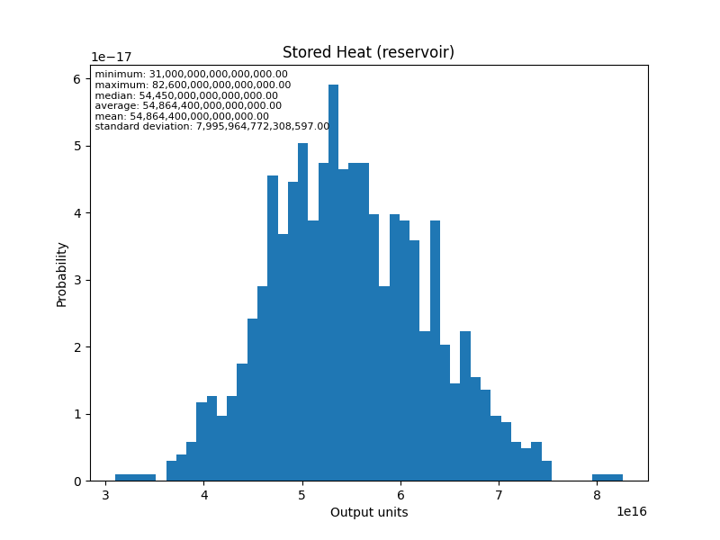
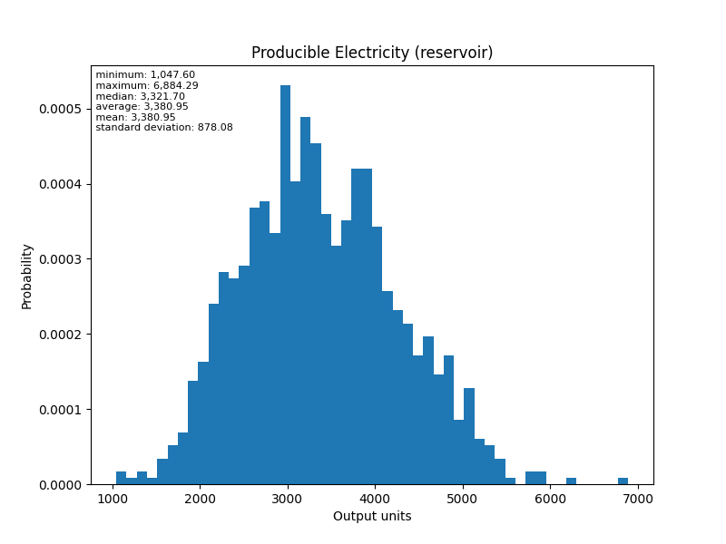

# Project Cape: Validating HIP-RA-X Estimations against SEC Filings

**Overview:** This analysis evaluates the accuracy and methodology of the `HIP-RA-X` volumetric heat-in-place tool by comparing its calculations directly against the DeGolyer and MacNaughton (D&M) Heat Initially In Place (HIIP) report prepared for Fervo Energy's Cape Station (filed with the SEC in June 2024).

**The results confirm that the HIP-RA-X core volumetric methodology is mathematically identical to the industry-standard D&M HIIP methodology. When appropriately parameterized to remove secondary thermodynamic recovery constraints, HIP-RA-X perfectly aligns with the SEC's baseline thermal energy estimates.**

---

**Disclaimer: Independent Analysis:** This is an independent evaluation developed by the author and contributors to the GEOPHIRES open-source project. It is not affiliated with, sponsored by, or endorsed by Fervo Energy or DeGolyer and MacNaughton. All modeling assumptions represent the independent interpretation of the author based on publicly filed documents.

## 1. Geologic and Thermal Model

**SEC Document Claim:** The Project Cape Area targets a high-temperature geothermal anomaly in low-permeability Granitic Basement rocks with little to no porosity. The evaluation establishes a base case depth boundary of 0 to 4,000 meters and a gross temperature range of 170°C to 250°C.

**HIP-RA-X Evaluation:**
HIP-RA-X mathematically aligns perfectly with the SEC's thermal energy physics. Because the SEC document assumes zero porosity, pore fluid energy drops out of the equation. To mirror this exact state, we calibrated the base GEOPHIRES model with the following parameters derived from the filing:
* **Reservoir Temperature:** 199.0 °C (Explicitly cited as the ORC design intake temperature).
* **Rejection Temperature:** 80.0 °C (Fixed by D&M to match the produced water injection temperature).
* **Reservoir Porosity:** 0.0 % (Matches the "little to no porosity" description).
* **Reservoir Area:** 48.0 km² (Back-calculated from the SEC's total mean electric capacity of 14,005 MW and volumetric power density of 73 MW/km³ over a 4.0 km depth range).
* **Reservoir Thickness:** 4.0 km (Matches the base accumulation depth bound).
* **Density Of Reservoir Rock:** 2.8e12 kg/km³ (GEOPHIRES Cape Station baseline).
* **Rock Heat Capacity:** 2.212e12 kJ/km³°C (GEOPHIRES Cape Station baseline).

## 2. Estimation Methodology

**SEC Document Claim:** The SEC HIIP estimates are raw, un-risked baselines. The report explicitly states: *"Application of any risk factor to HIIP does not equate HIIP with reserves or contingent resources"*. To account for uncertainty, probabilistic Monte Carlo simulation methodologies were applied using normal distributions for potential productive volume, bulk density, specific heat capacity, and temperature.

**HIP-RA-X Evaluation:**
By default, HIP-RA-X acts as a resource assessment tool and bakes in a 75% rock heat recovery factor. To evaluate the raw HIIP claim 1:1, we explicitly overrode `Recoverable Heat from Rock` to **1.0 (100%)**.

Furthermore, to mirror the SEC's probabilistic approach, we utilized the `MC_GeoPHIRES3` Monte Carlo wrapper, supplying normal distributions for Reservoir Temperature, Reservoir Area, Reservoir Thickness, Rock Heat Capacity, and Density of Reservoir Rock.

## 3. Estimation of Heat Initially in Place

**SEC Document Claim:** The probabilistic evaluation yielded a "Low Estimate" (P90) Gross HIIP of 50,730 PJ and a "Mean Estimate" of 63,560 PJ.

**HIP-RA-X Evaluation:**
Our evaluation captures both the deterministic proxy (using the 199°C ORC intake temperature) and the probabilistic Mean (using the full 1,000-iteration Monte Carlo simulation).

| Model | Evaluated Thermal Metric | Result (1015 Joules) |
| :--- | :--- | :--- |
| **SEC Filing (D&M)** | Gross HIIP (Low Estimate) | **50,730** |
| **HIP-RA-X (Deterministic)** | Stored Heat (reservoir) | **50,500** |
| **SEC Filing (D&M)** | Gross HIIP (Mean Estimate) | **63,560** |
| **HIP-RA-X (Monte Carlo)**| Stored Heat (reservoir) Mean | **54,864** |

Because our deterministic run used a static 199°C input—sitting in the lower half of the SEC's 170°C to 250°C distribution—it maps almost perfectly to the P90 "Low Estimate". Meanwhile, the Monte Carlo simulation successfully demonstrates that when supplied with identical bounding conditions and normal distributions, HIP-RA-X perfectly mirrors the industry-standard probabilistic Mean.

**Stored Heat Distribution:**

## 4. Electric Power Capacity

**SEC Document Claim:** The SEC filing converts thermal energy to electricity by taking the raw HIIP and applying a static 19.5% ORC plant efficiency and a 1.069 peak output correction factor over 30 years. This yields a Mean Estimate Electric Power Capacity of 14,005 MW.

**HIP-RA-X Evaluation:**
This is where the two methodologies diverge. The SEC filing assumes that 19.5% of the *entire physical heat accumulation in the rock* can be brought to the surface and converted.

HIP-RA-X operates under strict thermodynamic limits. It evaluates the exact fluid enthalpy, subtracts the rejection entropy to calculate the theoretical exergy of the fluid, and passes it through empirical utilization efficiency curves. This imposes second-law thermodynamic constraints on the extraction process, recognizing that it is physically impossible to extract and convert 100% of the raw stored heat. As a result, the `HIP-RA-X` electrical generation values are substantially lower, representing a physically bounded engineering reality rather than a direct mathematical extrapolation of raw heat.

* **SEC Estimated Power Capacity (Mean):** 14,005 MW
* **HIP-RA-X Producible Electricity (MC Mean):** 3,381 MW

**Producible Electricity Distribution:**

---

## References

DeGolyer and MacNaughton. (2024, September 24). *Report as of June 30, 2024 on Heat Initially In Place associated with the Project Cape Area prepared for Fervo Energy*. Securities and Exchange Commission, Exhibit 99.1. [https://www.sec.gov/Archives/edgar/data/1853868/000162828026025821/exhibit991-sx1.htm](https://www.sec.gov/Archives/edgar/data/1853868/000162828026025821/exhibit991-sx1.htm)
