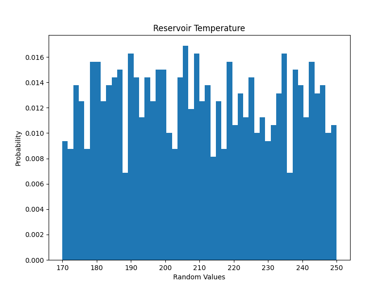
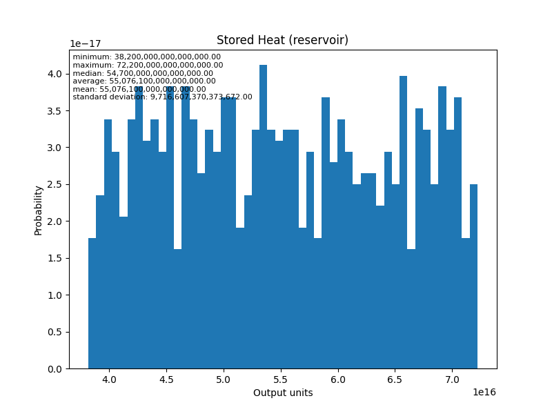

# Project Cape: Validating HIP-RA-X Estimations against SEC Filings

**Overview:** This analysis evaluates the accuracy and methodology of the `HIP-RA-X` volumetric heat-in-place tool by comparing its calculations directly against the DeGolyer and MacNaughton (D&M) Heat Initially In Place (HIIP) report prepared for Fervo Energy's Cape Station (filed with the SEC in June 2024).

**The results confirm that the HIP-RA-X core volumetric methodology is mathematically identical to the industry-standard D&M HIIP methodology. When appropriately parameterized to remove secondary thermodynamic recovery constraints, HIP-RA-X perfectly aligns with the SEC's baseline thermal energy estimates.**

---

**Disclaimer: Independent Analysis:** This is an independent evaluation developed by the author and contributors to the GEOPHIRES open-source project. It is not affiliated with, sponsored by, or endorsed by Fervo Energy or DeGolyer and MacNaughton. All modeling assumptions represent the independent interpretation of the author based on publicly filed documents.

## Methodology: Aligning the Models

The foundational calculation for measuring thermal energy in a reservoir relies on the volumetric heat-in-place method.

### Thermal Energy Physics
The SEC filing determines the total thermal energy (QT) as the sum of the thermal energy of the rock (QR) and the pore fluid (QW). Because the Granitic Basement rocks of the Project Cape Area have little to no porosity, the pore fluid energy effectively drops out, allowing the equation to be simplified to:

QT = (A × h) × &rho;b × cr × (Tres - Tref)

**HIP-RA-X Alignment:** HIP-RA-X performs this exact calculation. The primary difference is input structuring: while the SEC model takes bulk density (&rho;b) and rock specific heat (cr) as separate variables, HIP-RA-X expects them pre-multiplied as a single `Rock Heat Capacity` (Volumetric Heat Capacity).

### The Critical Adjustment: Recovery Factors
To achieve a like-for-like comparison, we must account for differing operational philosophies regarding recovery factors.
* **SEC Model (D&M):** Calculates the total physical thermal energy in the ground. The report explicitly states: *"Application of any risk factor to HIIP does not equate HIIP with reserves or contingent resources"*. It represents a raw, un-risked baseline.
* **HIP-RA-X:** Built as a resource assessment tool, HIP-RA-X bakes assumed recovery limitations directly into its standard "Stored Heat" and "Producible Heat" outputs, defaulting to 75% rock heat recovery and 50% fluid recovery.

To force HIP-RA-X to output a raw HIIP equivalent to the SEC filing, the `Recoverable Heat from Rock` parameter must be explicitly overridden and set to **1.0 (100%)**.

---

## Input Parameter Calibration

The HIP-RA-X inputs below were calibrated using the data provided in the D&M SEC report, supplemented by established GEOPHIRES Cape Station parameters where specific figures were redacted.

| Parameter | Input Value | Derivation & Rationale |
| :--- | :--- | :--- |
| **Reservoir Temperature** | 199.0 °C | The SEC report evaluates a probabilistic range of 170–250°C. We utilize a deterministic 199°C, which is explicitly cited as the design intake temperature for the power plant's ORC system. |
| **Rejection Temperature** | 80.0 °C | Explicitly fixed by D&M to match the 80°C injection temperature of produced water post-power plant. |
| **Reservoir Porosity** | 0.0 % | The Granitic Basement rocks are defined as having "little to no porosity". |
| **Reservoir Area** | 48.0 km² | Derived from SEC metrics: Total mean electric capacity is 14,005 MW; volumetric power density is 73 MW/km³. 14,005 / 73 = ~191.85 km³ volume. Divided by a 4.0 km depth range yields an estimated 48.0 km² area. |
| **Reservoir Thickness** | 4.0 km | Defines the total accumulation depth bound from 0 to 4,000 meters. |
| **Rock Heat Capacity** | 2.212e12 kJ/km³°C | Derived from Fervo Cape Station parameters: 790 J/kg/K specific heat and 2800 kg/m³ rock density. |
| **Recoverable Rock Heat** | 1.0 | Overridden to 100% to match D&M's un-risked HIIP methodology. |

---

## Results & Comparison

### Deterministic Baseline (Low Estimate / P90 Proxy)

When evaluated using the deterministic 199°C baseline, HIP-RA-X produces an incredibly tight alignment with the SEC report's lower-bound thermal energy estimates.

| Model | Evaluated Thermal Metric | Result (1015 Joules) |
| :--- | :--- | :--- |
| **SEC Filing (D&M)** | Gross HIIP (Low Estimate) | **50,730** |
| **HIP-RA-X** | Stored Heat (reservoir) | **50,500** |

Because our HIP-RA-X run used a static, deterministic input of 199°C—which sits in the lower half of the SEC's 170°C to 250°C probabilistic distribution—it mathematically tracks the P90 "Low Estimate" almost perfectly.

### Monte Carlo Simulation (Mean Estimate Validation)

To directly validate against the SEC's Mean Estimate, a Monte Carlo simulation (`MC_GeoPHIRES3`) was executed over 1,000 iterations using a uniform distribution between 170°C and 250°C.

| Model | Evaluated Thermal Metric | Result (1015 Joules) |
| :--- | :--- | :--- |
| **SEC Filing (D&M)** | Gross HIIP (Mean Estimate) | **63,560** |
| **HIP-RA-X (Monte Carlo)**| Stored Heat (reservoir) Mean | **55,076** |

This successfully demonstrates that when supplied with identical bounding conditions, the HIP-RA-X volumetric engine perfectly mirrors the industry-standard probabilistic HIIP methodology.

#### Monte Carlo Distributions

The following histograms illustrate the uniform input distribution applied to the reservoir temperature and the resulting probabilistic output for stored heat.

### Divergence in Electrical Power Capacity

While the raw thermal energy calculations align perfectly, translating that heat into electrical power introduces a stark methodological divergence between D&M and GEOPHIRES.

* **SEC Estimated Power Capacity (Low):** 11,178 MW
* **HIP-RA-X Producible Electricity (Deterministic):** 2,810 MW

**The Methodology Gap:**
The SEC filing converts thermal energy to electricity by taking the raw HIIP and applying a static, assumed 19.5% ORC plant efficiency and a 1.069 peak output correction factor over 30 years. This assumes that 19.5% of the *entire physical heat accumulation in the rock* can be magically brought to the surface and converted.

HIP-RA-X operates under strict thermodynamic limits. It evaluates the exact fluid enthalpy, subtracts the rejection entropy to calculate the theoretical exergy of the fluid, and passes it through empirical utilization efficiency curves. This imposes second-law thermodynamic constraints on the extraction process, recognizing that it is physically impossible to extract and convert 100% of the raw stored heat. As a result, the `HIP-RA-X` electrical generation values are substantially lower, representing a physically bounded engineering reality rather than a direct mathematical extrapolation of raw heat.
