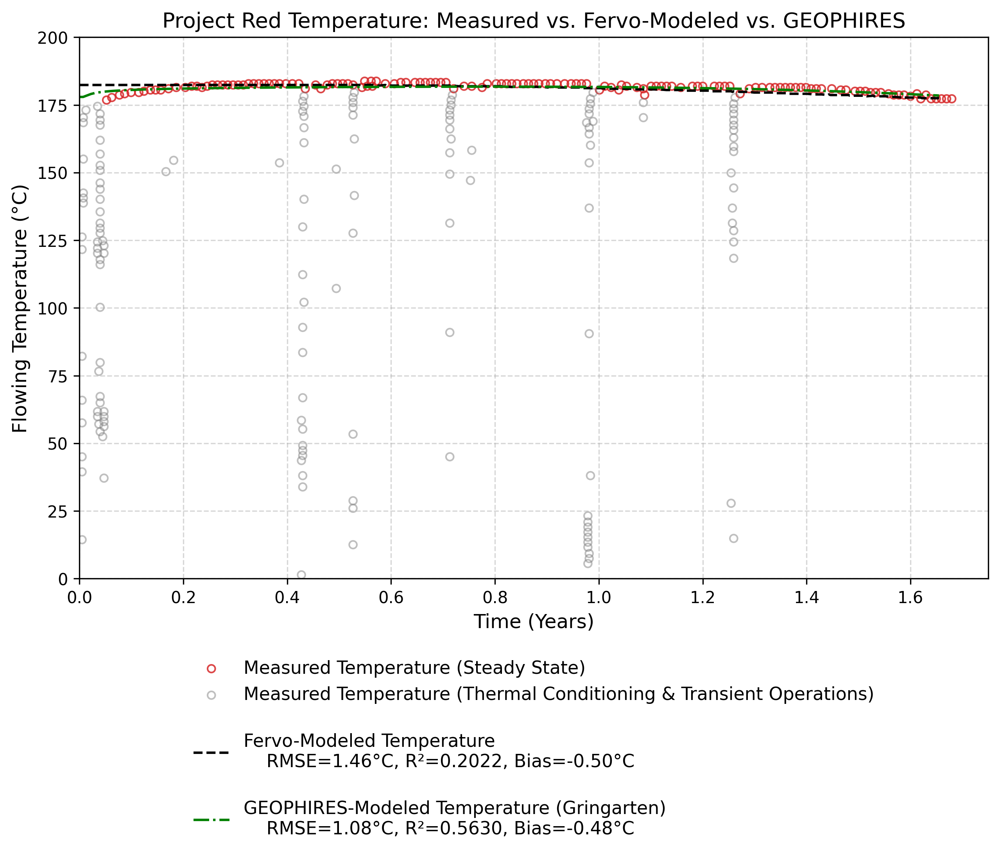
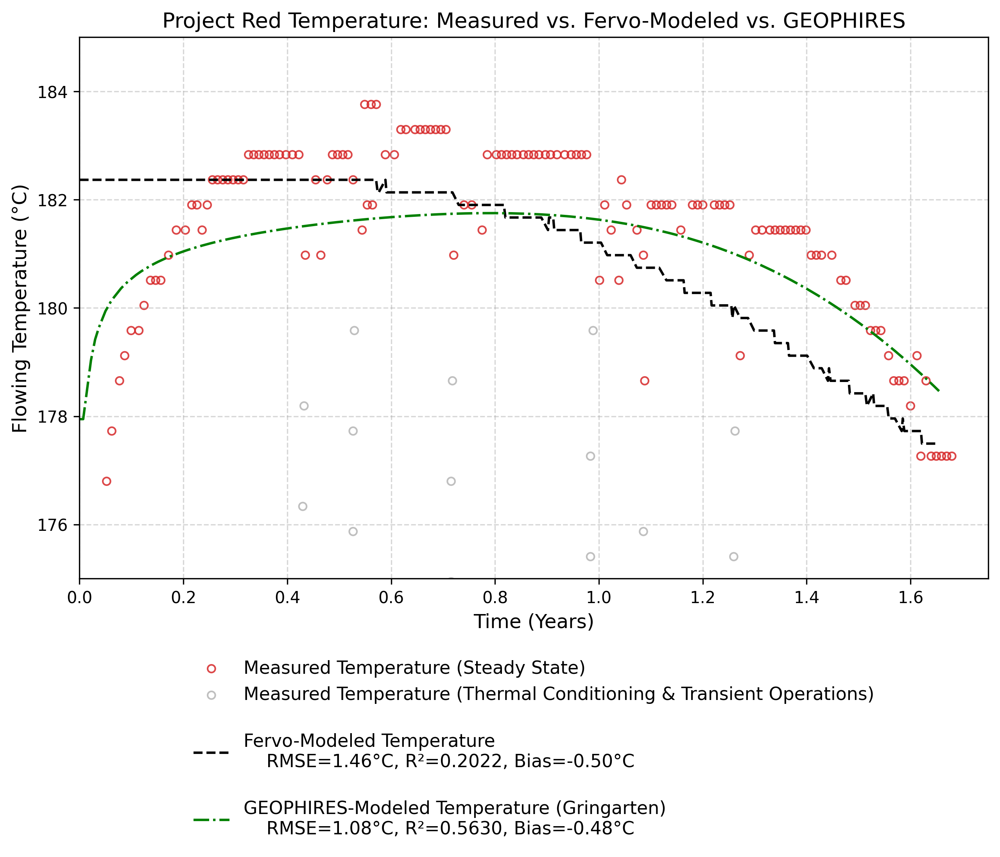

.. raw:: html

    

# Fervo Project Red

[Fervo_Project_Red-2026 example web interface link](https://gtp.scientificwebservices.com/geophires/?geophires-example-id=Fervo_Project_Red-2026)

This document evaluates the accuracy of geothermal production temperature modeling against empirical field data from the Fervo Project Red site. It compares measured flowing temperatures against two predictive models: Fervo's proprietary model and the analytical GEOPHIRES (Gringarten) model.

## Production Temperature: Measured vs. Modeled

The charts below plot the measured flowing temperature over a roughly two-year period. Data points captured during early thermal conditioning and transient operations (e.g., shut-ins, flow-rate testing) are rendered in gray and excluded from the steady-state statistical alignment.

*Detail view of the steady-state temperature plateau (175°C–185°C):*

## Statistical Alignment Analysis

The variance analysis (results displayed in legend captions) evaluates the predictive accuracy of both models against the measured steady-state data (excluding the initial thermal conditioning/ramp-up period).

Both models demonstrate high predictive fidelity, tracking steady-state flowing temperatures within 1.5°C of the empirical data.

* **Overall Fit:** GEOPHIRES mathematically achieves a tighter overall fit, yielding a lower Root Mean Square Error (RMSE) and a higher coefficient of determination (R²).
* **Systematic Bias:** The Fervo model exhibits slightly less systemic underestimation, with a cold bias of -0.50°C compared to the GEOPHIRES cold bias of -0.83°C.
* **R² Context:** The relatively low R² values for both models are expected statistical artifacts. Because the steady-state temperature profile is essentially a flat plateau, natural sensor variance and minor reservoir oscillations account for a disproportionately large portion of the total sum of squares, suppressing the R² score despite the low absolute error.

---

## Previous Versions

1. [Fervo_Norbeck_Latimer_2023](https://gtp.scientificwebservices.com/geophires/?geophires-example-id=Fervo_Norbeck_Latimer_2023)
